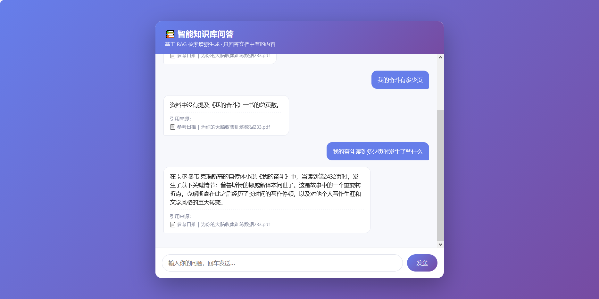
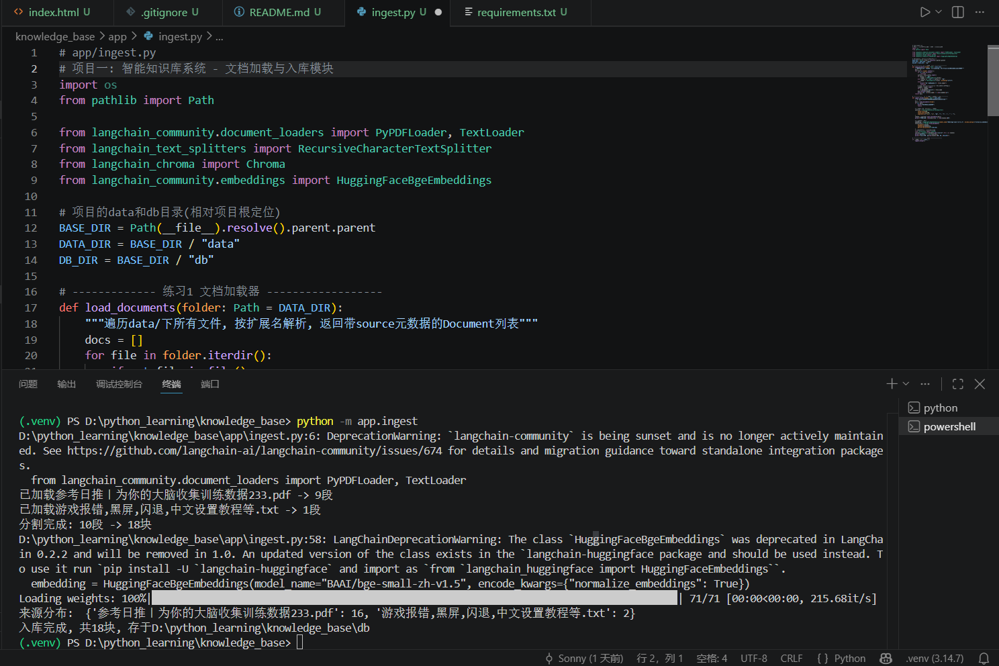
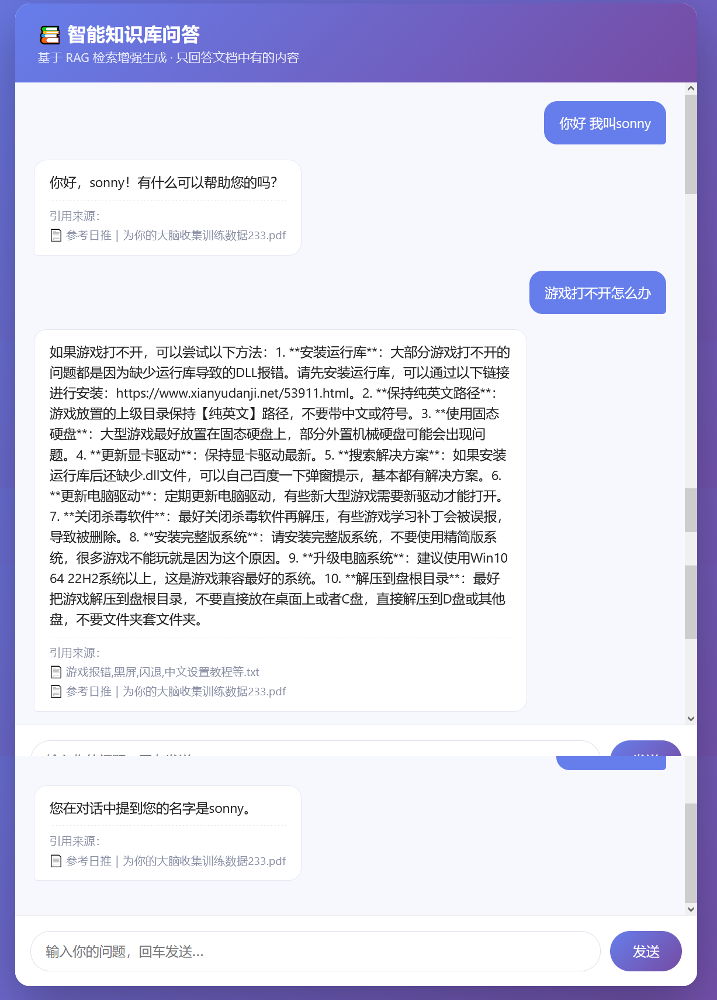

# 📚 智能知识库问答系统（RAG）
基于 **LangChain + Chroma + BGE + 智谱GLM** 的检索增强生成（RAG）智能问答系统。
支持多格式文档上传入库、语义检索、多轮对话记忆、引用来源追踪，并提供网页交互界面与 FastAPI 接口。

> 个人实战项目 · LangChain / RAG / Agent 应用开发

---

## ✨ 功能特性
- 📄 **多格式文档入库**：支持 PDF / TXT / Markdown / Word
- 🔍 **语义检索**：BGE 中文向量模型 + 余弦相似度 TopK 召回
- 🧠 **RAG 生成**：检索 → 拼接上下文 → 大模型生成回答，杜绝编造
- 📌 **引用来源追踪**：每个回答标注来自哪个文档
- 💬 **多轮对话记忆**：通过 thread_id 区分会话，能记住前文
- 🌐 **网页 + API 双端**：浏览器直接聊，也可通过 POST /ask 接口调用

---

## 🏗️ 架构
```
用户输入
   │
   ▼
[前端 index.html]  ──POST /ask──▶  [FastAPI main.py]
                                   │
                                   ▼
                          [Chroma 向量库] ◀── [ingest.py 入库]
                                   │ 检索 topK
                                   ▼
                          [BGE embedding]
                                   │ context
                                   ▼
                          [智谱 GLM-4] ──生成回答──▶ 返回 {answer, sources}
```

## 🧩 模块划分
| 文件 | 作用 |
|---|---|
| `app/ingest.py` | 文档加载/分割/向量化/入库 |
| `app/retrieve.py` | 语义检索 + 来源追踪 |
| `app/qa.py` | 检索 + Prompt + 生成（单轮） |
| `app/main.py` | FastAPI 服务层 + 多轮记忆 + 静态页 |
| `static/index.html` | 网页问答界面 |

---

## 🚀 快速开始
### 1. 安装依赖
```bash
cd knowledge_base
python -m venv .venv && .venv\Scripts\activate   # Windows
pip install -r requirements.txt
```
> 主要依赖：langchain、langchain-chroma、langchain-community、
> langchain-openai、sentence-transformers、fastapi、chromadb、python-docx、pypdf

### 2. 配置 API Key
在项目根目录建 `.env`：
```
ZHIPU_API_KEY=你的智谱key
```

### 3. 入库（把文档放进 `data/` 后）
```bash
python -m app.ingest
```

### 4. 启动服务
```bash
python -m uvicorn app.main:app --reload
```
浏览器打开 `http://127.0.0.1:8000/static/index.html` 开始提问。

### 5. 调用接口
```bash
curl -X POST http://127.0.0.1:8000/ask \
  -H "Content-Type: application/json" \
  -d '{"thread_id":"test","question":"售后怎么处理"}'
```
返回：`{"answer":"...","sources":["xxx.md"]}`

---

## 🖼️ 效果截图
 !

---

## 🧠 技术要点
- **RAG 全链路**：加载 → 分割 → 向量化 → 检索 → 生成
- **BGE embedding 归一化**：`normalize_embeddings=True`，保证向量空间一致
- **防幻觉**：提示词强制"资料没有就说没有，不编造"
- **多轮记忆**：内存字典 `sessions[thread_id]` 维护会话历史（生产可换 Redis）
- **TopK 检索**：`similarity_search_with_score` 召回 + 来源去重

---

## 📌 待优化（Roadmap）
- [ ] 混合检索（BM25 + 向量）提升精确召回
- [ ] 记忆落库 Redis 持久化
- [ ] Docker 部署
- [ ] 上传接口（前端拖拽文档入库）